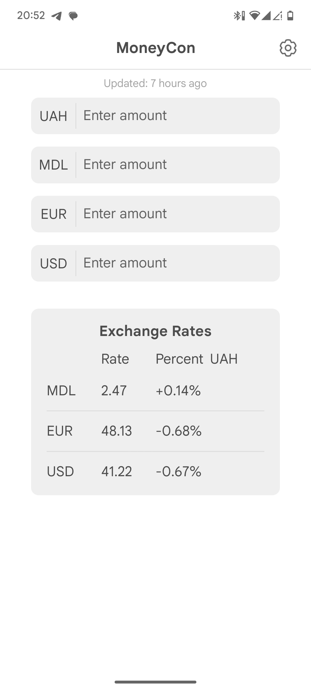
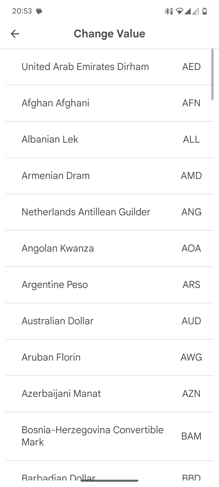
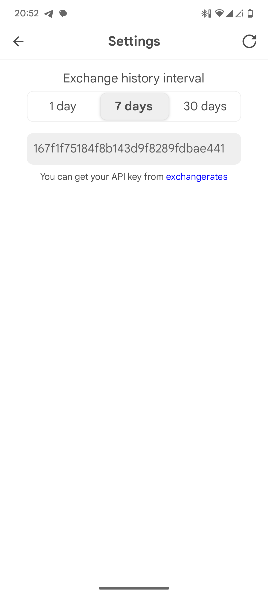
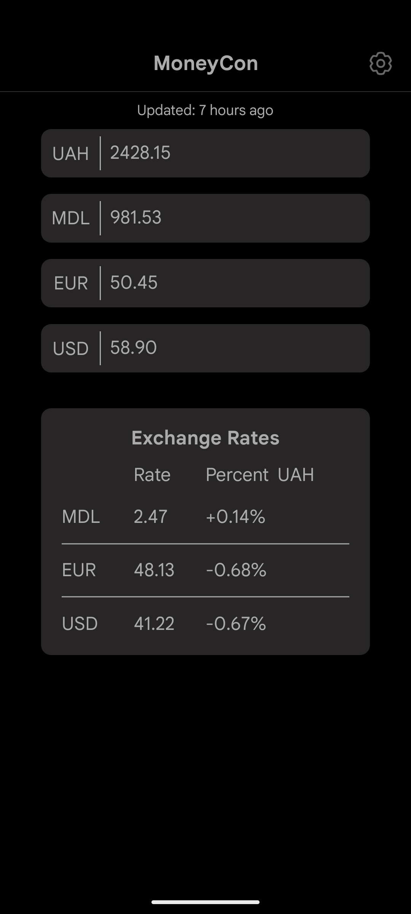
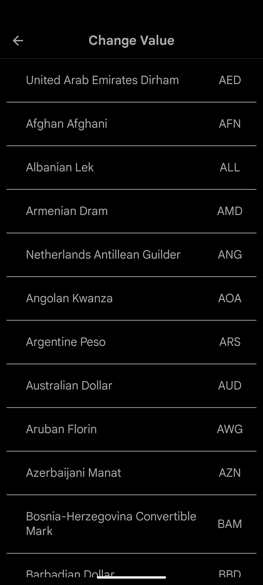
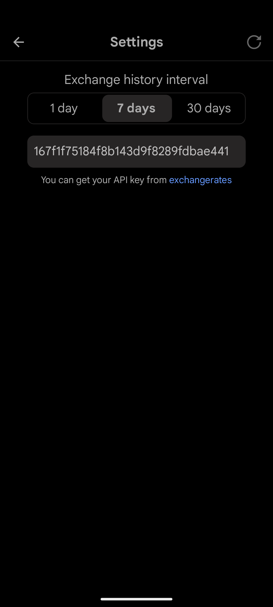

<div align="center">
    
    <h1>MoneyCon</h1>
    <p>MoneyCon is a simple way to convert on currency to another!</p>
    <p>Built with <a href="https://reactnative.dev/">React Native</a> and <a href="https://expo.dev/">Expo</a></p>
    <p>Powered by <a href="https://exchangeratesapi.io/">exchangeratesapi.io</a></p>
    <p>Icons by <a href="https://icons8.com/">Icons8</a></p>
    <p>Logo by <a href="htpps://chatgpt.com/">ChatGPT</a></p>
    <a href="##screenshots">Screenshots</a>&middot;<a href="https://github.com/kboddya/MoneyCon/releases">Releases</a>
</div>

## About
MoneyCon is a simple currency converter that allows you to convert one currency to another using the latest exchange rates.
Built with TS, React Native and expo, it is a cross-platform app that works on both iOS and Android.
For the backend, it uses the <a href="https://exchangeratesapi.io/">exchangeratesapi.io</a> API to get the latest and historical exchange rates.
## Screenshots
|                                                               |                      <h3>Light mode</h3>                      |                                                               |
|:-------------------------------------------------------------:|:-------------------------------------------------------------:|:-------------------------------------------------------------:|
|  |  |  |
|                                                               |                      <h3>Dark mode</h3>                       |                                                               |
|   |   ||
## Installation
For install, you can download the latest release from the <a href="https://github.com/kboddya/MoneyCon/releases">releases</a> page or clone the repository and run the app using expo.
```bash
git clone https://github.com/kboddya/MoneyCon
cd MoneyCon
npm install
npx expo start
```
You can then scan the QR code with the expo app on your phone or run the app in an emulator.
## LICENSE
This project is licensed under the MIT License - see the [LICENSE](LICENSE) file for details